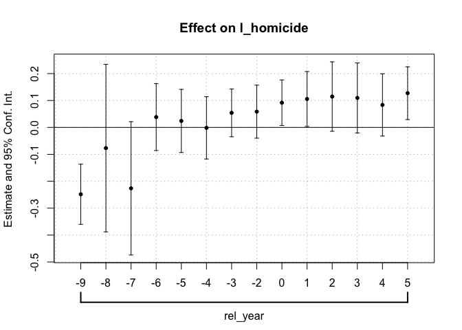
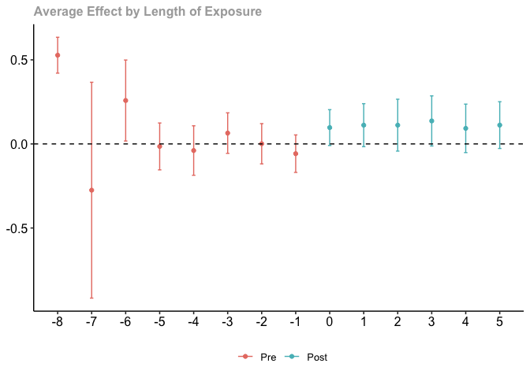

# Cheng and Hoekstra (2013)

We are going to revisit the analysis performed by Cheng and Hoekstra on
the effect of “Stand Your Ground” gun laws on homicides. To begin, load
the data from
`https://github.com/scunning1975/mixtape/raw/master/castle.dta`. The
main variables of interest are: the state id, denoted by `sid`; the
`year` of the observation; the log of the number of homocides in the
state denoted `l_homicide`; and `effyear` which measures the year in
which the Stand Your Ground law was implemented in a state.

Before we begin, we need to do some data work to prepare for estimation.
For estimators, we need to change `effyear` to 0 for the control states.
They are in the data as `NA` in R or `.` in Stata. Then, Take the
variable `effyear` and `year` and construct an event-time variable
(i.e. `year` - `effyear` or $t - g$ in Callaway and Sant’Anna’s syntax).
For the control units, you should set the relative year indicator to
`-1`. More, create a variable `treat` that denotes when treatment is
active, i.e. when `year` is greater than or equal to `effyear`.

``` r
## cheng_hoekstra.R ------------------------------------------------------------
## Kyle Butts, CU Boulder Economics
## 
## Various Difference-in-Differences Estimators with Cheng and Hoekstra dataset.

library(haven)
library(tidyverse)
```

    ── Attaching packages ─────────────────────────────────────── tidyverse 1.3.1 ──

    ✔ ggplot2 3.3.6     ✔ purrr   0.3.4
    ✔ tibble  3.1.8     ✔ dplyr   1.0.9
    ✔ tidyr   1.2.0     ✔ stringr 1.4.0
    ✔ readr   2.1.2     ✔ forcats 0.5.2

    ── Conflicts ────────────────────────────────────────── tidyverse_conflicts() ──
    ✖ dplyr::filter() masks stats::filter()
    ✖ dplyr::lag()    masks stats::lag()

``` r
library(fixest) 
library(did2s)
```

    ℹ did2s (v0.7.0). For more information on the methodology, visit <https://www.kylebutts.com/did2s>

    To cite did2s in publications use:

      Butts, Kyle (2021).  did2s: Two-Stage Difference-in-Differences
      Following Gardner (2021). R package version 0.7.0.

    A BibTeX entry for LaTeX users is

      @Manual{,
        title = {did2s: Two-Stage Difference-in-Differences Following Gardner (2021)},
        author = {Kyle Butts},
        year = {2021},
        url = {https://github.com/kylebutts/did2s/},
      }

``` r
library(did)
library(bacondecomp)
```


    Attaching package: 'bacondecomp'

    The following object is masked from 'package:did2s':

        castle

``` r
castle <- haven::read_dta('https://github.com/scunning1975/mixtape/raw/master/castle.dta')

# Never treated have `effyear` = Inf
castle[is.na(castle$effyear), ]$effyear <- 0
castle$rel_year = castle$year - castle$effyear
castle[castle$effyear == 0, ]$rel_year <- -1
castle$treat = castle$year >= castle$effyear
```

1.  Now that our data is in the correct order, we will estimate the
    standard TWFE event-study.

``` r
# 1. TWFE Event-study regression -----------------------------------------------

# estimate the effect on log(homicide)
es_twfe <- feols(
  l_homicide ~ i(rel_year, ref = -1) | sid + year, 
  castle, cluster = ~ sid
) 

coefplot(es_twfe)
```

<!-- -->

2.  Use the Callaway and Sant’Anna estimator to estimate the group-time
    average treatment effects, $ATT(g,t)$. Then aggregate these to
    event-study treatment effects. *Note:* use `did` package in R or the
    `csdid` package in Stata.

``` r
# 2. Callaway and Santa'Anna ---------------------------------------------------

# Estimating the effect on log(homicide)
atts <- att_gt(
  yname = "l_homicide",
  tname = "year",
  idname = "sid",
  gname = "effyear",
  clustervars = "sid",
  # They require g to be equal to 0
  data = castle,
  # no covariates
  xformla = NULL, 
  # with covariates
  # xformla = ~ X_Iyear_2010, 
  # set the comparison group which is either "nevertreated" or "notyettreated" 
  control_group = "nevertreated"
)
```

    Warning in pre_process_did(yname = yname, tname = tname, idname = idname, : Be aware that there are some small groups in your dataset.
      Check groups: 2005,2007,2008,2009.

    Warning in att_gt(yname = "l_homicide", tname = "year", idname = "sid", : Not
    returning pre-test Wald statistic due to singular covariance matrix

``` r
es_cs <- aggte(atts, type = "dynamic")
ggdid(es_cs)
```

<!-- -->

1.  In R you will receive the following error:

<!-- -->

    Warning messages:
    1: In pre_process_did(yname = yname, tname = tname, idname = idname,  :
      Be aware that there are some small groups in your dataset.
      Check groups: 2005,2007,2008,2009.

Describe why you might be getting this error

*Answer*: This error comes up because there are few treated states in
each of these groups. Therefore you should be careful when conducting
inference on any particular $ATT(g,t)$. This problem can be mitigated by
averaging $ATT(g,t)$

3.  Then, use the imputation-estimator to estimate event-study
    coefficients. Note that BJS, Gardner, and Wooldridge’s Mundlak
    estimators will produce the same exact point estimate. *Note:* use
    `did2s` package in R or Stata.

``` r
# 3. Imputation Estimator ------------------------------------------------------

# Note the point estimates will be identical to `didimputation` and the Mundlak regression

es_imputation <- did2s(
  yname = "l_homicide",
  first_stage = ~ 1 | sid + year, 
  second_stage = ~ i(rel_year, ref = -1s), 
  treatment = "treat", 
  cluster_var = "sid",
  data = castle
)

coefplot(es_imputation)
```

    Error: <text>:8:40: unexpected symbol
    7:   first_stage = ~ 1 | sid + year, 
    8:   second_stage = ~ i(rel_year, ref = -1s
                                              ^

4.  Next, use the Sun and Abraham event-study estimator. *Note:* use
    `sunab` function within the `fixest` package in R or the
    `eventstudyinteract` package in Stata.

``` r
# 4. Sun and Abraham -----------------------------------------------------------

es_sa = feols(
  l_homicide ~ sunab(effyear, year) | sid + year,
  data = castle, cluster = ~ sid
)

coefplot(es_sa)
```

<!-- -->

5.  Last, construct a stacked estimator where for each group, you keep
    all not-yet-treated observations and the never treated obserations.
    Keep observations only for event-time between -5 and +4. Make sure
    to properly stack the data and cluster at the `sid` x stack_id
    level.

``` r
# 5. Stacking Estimator --------------------------------------------------------

# Loop through each `effyear` and create our dataset
stacked <- NULL
# Get groups except for never-treated 0
groups <- setdiff(unique(castle$effyear), 0)

for(g in groups) {
  stacked <- bind_rows(stacked, 
    castle |> 
      filter(effyear == g | effyear == 0 | year < effyear) |>
      filter((rel_year >= -5 & rel_year <= 4) | effyear = 0) |>
      mutate(stack_id = g)
  )
}

feols(
  l_homicide ~ i(rel_year, ref = -1) | sid^stack_id + year^stack_id, 
  data = stacked, cluster ~ sid^stack_id
) |> 
  coefplot()
```

    Error: <text>:12:57: unexpected '='
    11:       filter(effyear == g | effyear == 0 | year < effyear) |>
    12:       filter((rel_year >= -5 & rel_year <= 4) | effyear =
                                                                ^
