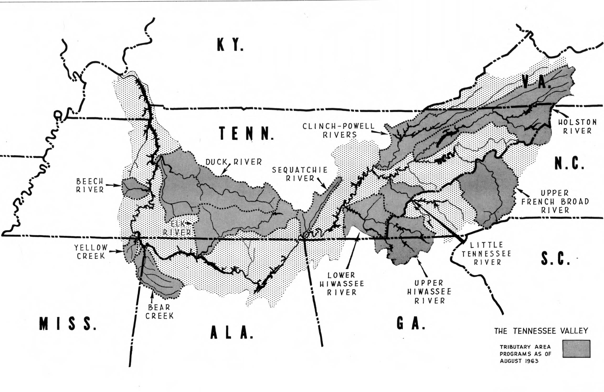

# Tennessee Valley Authority Empirical Application

## Intro

This exercise is going to work with data from Kline and Moretti (2014).
This paper aims to analyze the impacts of the “Tennessee Valley
Authority” (TVA) on local agriculture and manufacturing employment. The
TVA was a huge federal spending program in the 1940s that aimed at
electrification of the region, building hundreds of large dams (in
Scott’s terms, a ton of ‘bite’).

The region was centered in Tennessee and surrounding other southern
states. The region had a large agriculture industry, but very little
manufacturing. Electrification brought in a lot industry, moving the
economy away from agriculture. We are going to test for this in the data
using census data (recorded every 10 years).




``` r
library(tidyverse)
library(fixest)
library(DRDID)
library(did)
```

Our dataset looks like this:

``` r
df = read_csv("data/tva.csv")
head(df)
```

    # A tibble: 6 × 18
      county_code  year   tva treat  post ln_agriculture ln_manufacturing
      <chr>       <dbl> <dbl> <dbl> <dbl>          <dbl>            <dbl>
    1 01001        1920     0     0     0           8.49             6.41
    2 01001        1930     0     0     0           8.64             6.36
    3 01001        1940     0     0     0           8.39             6.66
    4 01001        1950     0     0     1           7.78             7.14
    5 01001        1960     0     0     1           7.12             7.26
    6 01003        1920     0     0     0           8.35             7.10
    # ℹ 11 more variables: agriculture_share_1920 <dbl>,
    #   agriculture_share_1930 <dbl>, manufacturing_share_1920 <dbl>,
    #   manufacturing_share_1930 <dbl>, ln_avg_farm_value_1920 <dbl>,
    #   ln_avg_farm_value_1930 <dbl>, white_share_1920 <dbl>,
    #   white_share_1930 <dbl>, white_share_1920_sq <dbl>,
    #   white_share_1930_sq <dbl>, county_has_no_missing <lgl>

## Question 1

We will perform the basic 2x2 DID using just the years 1940 and 1960. We
will use as outcomes `ln_agriculture` and `ln_manufacturing`.

First, run the “classic” version using an indicator for treatment,
`tva`, and indicator for being the post-period, `post`, and the product
of the two. I recommend the package `fixest` for regression analysis.
I’ll be using it in the solutions.

Second, we will see in the 2x2 DID case, using county and time fixed
effects is equivalent:

## Question 2

Moretti and Kline were nervous that the parallel trends assumption is a
bit of a strong assumption in the context. Why might that be in the
context of the Tennessee Valley Authority?

Answer: The TVA was built in the Tenneessee area precisely because the
area was not developing a strong manufacturing base. It is unlikely in
the absence of treatment that counties in the TVA area were going to
grow in manufacturing the same as outside counties

Let’s run a placebo analysis to test for this using 1920 as the
pre-treatment period and 1930 as the post-treatment period. What does
this tell us about the plausability of a parallel trends type
assumption?


## Question 3

Let’s put this analysis together and run an event-study regression using
the full dataset

To do this, create a set of dummy variables that interact year with
treatment status. Estimate the TWFE model with these dummy variables.


## Question 4

Let’s use some controls to weaken the assumption to conditional parallel
trends. In particular, we are going to use a few covariates:
`agriculture_share_1920`, `agriculture_share_1930`,
`manufacturing_share_1920`, and `manufacturing_share_1930`.

What happens if we add those controls in linearly to our original 1940 to 1960
estimate?


## Question 5

This question shows different weighs to incorporate covariates in a 2x2 difference-in-differences estimator. The goal is to relax our parallel trends assumption to be conditional on X:

$$
  E(Y_{i1}(0) - Y_{i1}(0) | D = 1, X = x) = E(Y_{i1}(0) - Y_{i1}(0) | D = 0, X = x).
$$

In words, this assumption says "take treated and control units with the same value of $X$. These units on average have the same counterfactual trend". Full details to help with this question are given below in the appendix notes. This question will walk you through three different covariates-based estimators of ATTs: outcome regression, inverse propensity of treatment weighting, and a doubly-robust combination of the two. For this rest of the exercise, we will just estimate `ln_manufacturing`.

Note: Some of the data contains missing values for the covariates. Subset the data using `county_has_no_missing == TRUE` (for later).


### Part 1: Difference-in-Differences

Take first-differences of the outcome variable to form $\Delta Y$. Create a new dataset that collapses the dataset using first-differences for the outcome variables (each county should be a single row in the dataset). 

In part a, estimate the normal difference-in-differences estimate. Additionally, run a second model that linearly controls for `agriculture_share_1920`, `agriculture_share_1930`, `manufacturing_share_1920`, and `manufacturing_share_1930`.

### Part 2: Outcome Regression

Including covariates linearly is very simple and intuitively it allows for $X_i$-specific trends. However, this assumes that treatment effects can not vary by the value of $X$. For example, say $X$ is a dummy variable for age. Then you are allowing for gender-specific trends, but you are not allowing for treatment effects to vary by age. Note, this problem is only with continuous covariates in X_i, we won't estimate the ATT (see Angrist 1998 or Słoczyński 2022). 

Instead, we want to use outcome regression when doing covariate adjustment in the outcome model. First, regress `D_ln_y` on the four covariates *using just the untreated observations* (`tva == 0`). This estimates $E(\Delta y | X, D = 0)$. 

Second, predict out of sample this model for the full dataset. Let's call this `D_ln_y0_hat`. Last, take the difference between `D_ln_y` and the predicted `D_ln_y0_hat` and average this for the treated group (`tva == 1`). This is our outcome regression estimate.

### Part 3: Inverse Probability of Treatment Weighting

Now, lets use a propensity score method. Estimate a logistic regression of $D$ on the covariates $X$ using the full sample. Predict fitted propensity scores of this model. 

Form the weights $w_1$ and $w_0$ as written in the appendix and form the IPTW estimate.

### Part 4: Doubly-Robust DID Estimator

From the previous questions, you have all the parts to estimate the doubly-robust DID estimator. Do this.


## Question 6

Now, let’s try using the `DRDID` package to do this more simply.

Note: In R, DRDID requires the `idname` to be a numeric, so you need to create a new variable for this.


## Question 7

We are going to now use `did` to estimate an event study. As a default,
`did` calls `DRDID` under the hood. Let’s see this using `did::att_gt`.
We need to create a variable for “treatment timing groups”, i.e. what
year a county starts treatment. The package takes the convention that
group = 0 for never-treated group.

``` r
# = 0 for never-treated, = 1950 for TVA counties
df$g = df$tva * 1945
```


## Appendix: Notes on Covariates in 2x2 DID 

In the 2x2 case for panel data, we will always form a difference-in-differences style estimand:

$$
  \mathbb{E}_n \left[ (w_1 - w_0) \widetilde{\Delta Y} \right]
$$

where $w_1$ and $w_0$ are sets of weights and $\widetilde{\Delta Y}$ is either $\Delta Y$ or deviations from estimates from an outcome regression $\Delta Y - \hat{\mu}_{\Delta Y(0)}(X)$. Since github won't render properly, we are going to write it as $\hat{\mu}(X)$ 

### Case 1: DID

For the simplest DID, we have $w_1 = \frac{D}{\mathbb{P}_n(D = 1)}$ and $w_0 = \frac{1 - D}{\mathbb{E}_n(1 - D)}$ and $\widetilde{\Delta Y} = \Delta Y$. These weights are equivalent to taking averages for the treated and untreated groups respectively.

This produces: 

$$
  \mathbb{E}_n \left[ (w_1 - w_0) \widetilde{\Delta Y} \right] = 
  \mathbb{E}_n \left[ \Delta Y \ \vert \ D = 1 \right] - \mathbb{E}_n\left[ \Delta Y \ \vert \ D = 0 \right]
$$

We are comparing change in outcomes for treated group to the change in outcomes of the control group.

### Case 2: Outcome regression

Estimate $\mu_{\Delta Y(0)}(X)$ by regressing $\Delta Y$ on $X$ using the $D = 0$ untreated sample. Form $\widetilde{\Delta Y} = \Delta Y - \hat{\mu}(X)$. Set $w_1 = \frac{D}{\mathbb{P}_n(D = 1)}$ and $w_0 = 0$. 

This produces: 

$$
  \mathbb{E}_n\left[ (w_1 - w_0) \widetilde{\Delta Y} \right] = \mathbb{E}_n\left[ \Delta Y \ \vert \ D = 1 \right] - \mathbb{E}_n\left[ \hat{\mu}(X) \ \vert \ D = 1 \right]
$$

We are comparing change in outcomes for treated group to the *predicted* change in outcomes for the treated group given the values of their covariates $X$.

### Case 3: IPW Estimator (Abadie, 2005)

Estimate $p(x) = \mathbb{P}(D = 1 | X = x)$ by a logistic regression of $D$ on $X$ for the full sample. Form $\hat{p}(X)$ for each unit. Set $\widetilde{\Delta Y} = \Delta Y$. 

The weights take the form $w_1 = \frac{D}{\mathbb{P}_n(D = 1)}$ and $w_0 = \frac{1}{\mathbb{P}_n(D = 1)} \frac{(1-D) \hat{p}(X)}{1 - \hat{p}(X)}$. 

This produces:

$$
  \mathbb{E}_n\left[ (w_1 - w_0) \widetilde{\Delta Y} \right] = 
  \mathbb{E}_n\left[ \Delta Y \ \vert \ D = 1 \right] - 
    \mathbb{E}_n\left[ \frac{\mathbb{P}_n(D = 0)}{\mathbb{P}_n(D = 1)} \frac{\hat{p}(X)}{1 - \hat{p}(X)} \Delta Y \ \vert \ D = 0\right]
$$

We are comparing change in outcomes for treated group to a *weighted* average of the control group's counterfactual trend. The inverse probability of treatment weights are to make the control group look more like the treated group.

> [!WARNING]  
> The weights are the ones proposed originally in Abadie (2005). They are based on Horvitz-Thompson weights (1952, JASA). These are sensitive when there is problems with the overlap conditions. Sant'Anna and Zhao (2020) (amongst others) suggest using Hajek weights, normalizing the Horvitz-Thompson weights by the sample mean of $w$. This is the default with `drdid::ipwdid`.
>
> For $w_0$, the Hajek weights are $\frac{1}{\mathbb{P}_n(D = 1)} \frac{(1-D) \hat{p}(X)}{1 - \hat{p}(X)} / \mathbb{E}_n(\frac{(1-D) \hat{p}(X)}{1 - \hat{p}(X)})$. The Hajek weights are unchanged for $w_1$ since $w_1 = \frac{D}{\mathbb{P}_n(D = 1)} / \mathbb{E}(\frac{D}{\mathbb{P}_n(D = 1)}) = w_1$. 
> 
> (h/t to Pedro Sant'Anna for bringing this up)


### Case 4: Doubly-Robust DID (Sant'Anna and Zhao)

Set $\widetilde{\Delta Y} = \Delta Y - \hat{\mu}(X)$. The weights take the form $w_1 = \frac{D}{\mathbb{P}_n(D = 1)}$ and $w_0 =  \frac{(1-D) \hat{p}(X)}{1 - \hat{p}(X)} / \mathbb{E}_n(\frac{(1-D) \hat{p}(X)}{1 - \hat{p}(X)})$ (Hajek-weights).

This produces:

$$
  \mathbb{E}_n\left[ (w_1 - w_0) \widetilde{\Delta Y} \right] =
  \mathbb{E}_n\left[ \Delta Y - \hat{\mu}(X) \ \vert \ D = 1 \right] - 
  \mathbb{E}_n\left[ \frac{\mathbb{P}_n(D = 0)}{\mathbb{P}_n(D = 1)} \frac{\hat{p}(X)}{1 - \hat{p}(X)} \left( \Delta Y - \hat{\mu}(X) \right) \ \vert \ D = 0\right]
$$


To help build intuition, I'll rewrite this in two ways. First,

$$
\begin{align*}
  \mathbb{E}_n\left[ (w_1 - w_0) \widetilde{\Delta Y} \right] &= 
  \left( 
    \mathbb{E}_n\left[ \Delta Y \ \vert \ D = 1 \right] - 
    \mathbb{E}_n\left[ \hat{\mu}(X) \ \vert \ D = 1 \right] 
  \right) \\
  &\quad - \left(
    \mathbb{E}_n\left[ \frac{\mathbb{P}_n(D = 0)}{\mathbb{P}_n(D = 1)} \frac{\hat{p}(X)}{1 - \hat{p}(X)} \Delta Y \ \vert \ D = 0\right] - 
    \mathbb{E}_n\left[ \frac{\mathbb{P}_n(D = 0)}{\mathbb{P}_n(D = 1)} \frac{\hat{p}(X)}{1 - \hat{p}(X)} \hat{\mu}(X) \ \vert \ D = 0\right]
  \right)
\end{align*}
$$

In this form, it looks like we are taking out outcome regression estimate and then subtrating off something like a bias-correction term generated from the control group

Alternatively, we could regroup terms like

$$
\begin{align*}
  \mathbb{E}_n\left[ (w_1 - w_0) \widetilde{\Delta Y} \right] &= 
  \left( 
    \mathbb{E}_n\left[ \Delta Y \ \vert \ D = 1 \right] - 
    \mathbb{E}_n\left[ \frac{\mathbb{P}_n(D = 0)}{\mathbb{P}_n(D = 1)} \frac{\hat{p}(X)}{1 - \hat{p}(X)} \Delta Y \ \vert \ D = 0\right]
  \right) \\
  &\quad - \left(
    \mathbb{E}_n\left[ \hat{\mu}(X) \ \vert \ D = 1 \right]  - 
    \mathbb{E}_n\left[ \frac{\mathbb{P}_n(D = 0)}{\mathbb{P}_n(D = 1)} \frac{\hat{p}(X)}{1 - \hat{p}(X)} \hat{\mu}(X) \ \vert \ D = 0\right]
  \right)
\end{align*}
$$

In this form, it looks like we are taking the IPW estimate and then subtracting off something like a bias-correction term. 


## Note: Equivalence of Sant'Anna and Zhao's IPW Definition

The IPW weights given above are equivalent to what Sant'Anna and Zhao write. From case 3, we use algebra to simplify:

$$
\begin{align*}
  w_1 - w_0 &= 
  \frac{D}{\mathbb{P}_n(D = 1)} - \frac{1 - D}{\mathbb{P}_n(D = 1)} \frac{\hat{p}(X)}{1 - \hat{p}(X)} \\
  &= \frac{1}{\mathbb{P}_n(D = 1)} * \left( D - (1 - D) \frac{\hat{p}(X)}{1 - \hat{p}(X)} \right) \\
  &= \frac{1}{\mathbb{P}_n(D = 1)} * \frac{D * (1 - \hat{p}(X)) - (1 - D) \hat{p}(X)}{1 - \hat{p}(X)} \\
  &= \frac{1}{\mathbb{P}_n(D = 1)} * \frac{D - D*\hat{p}(X) - \hat{p}(X) + D*\hat{p}(X)}{1 - \hat{p}(X)} \\
  &= \frac{1}{\mathbb{P}_n(D = 1)} * \frac{D - \hat{p}(X)}{1 - \hat{p}(X)} \\
\end{align*}
$$


