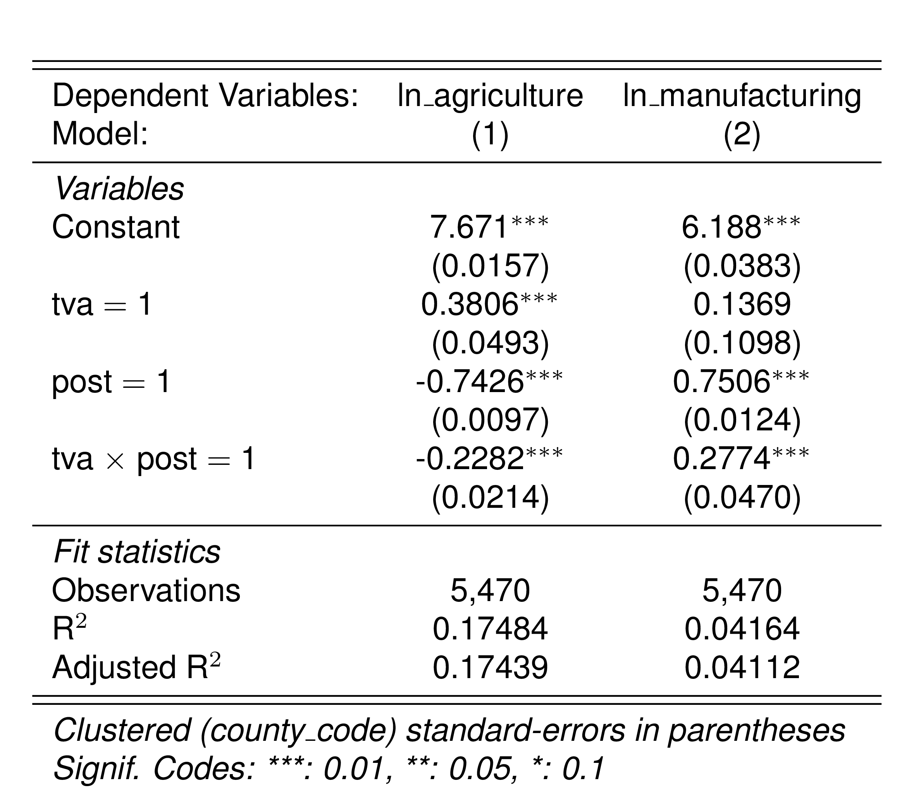
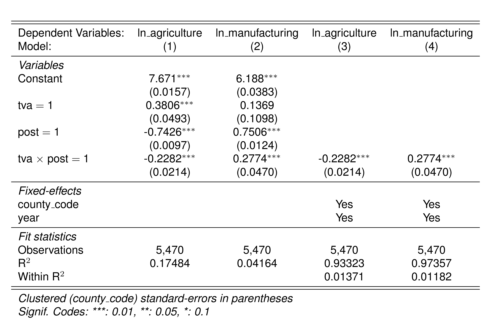
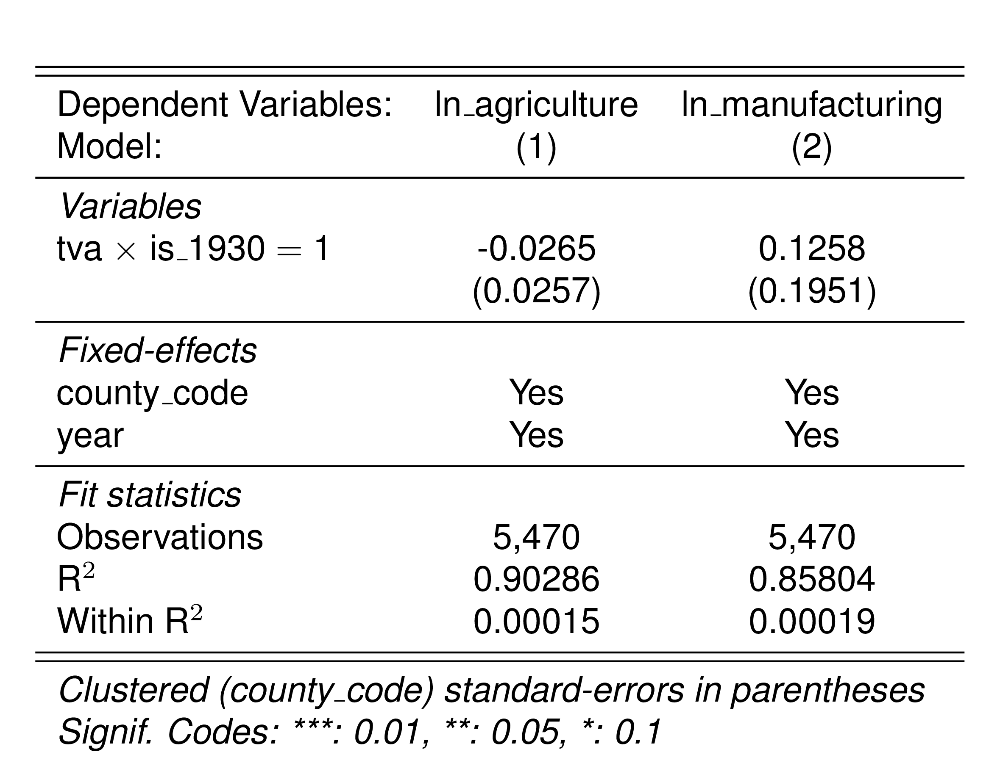
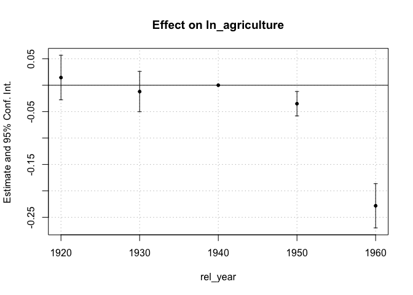
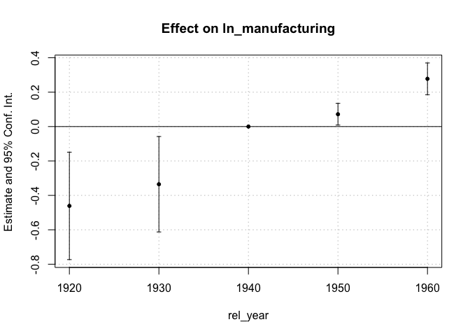
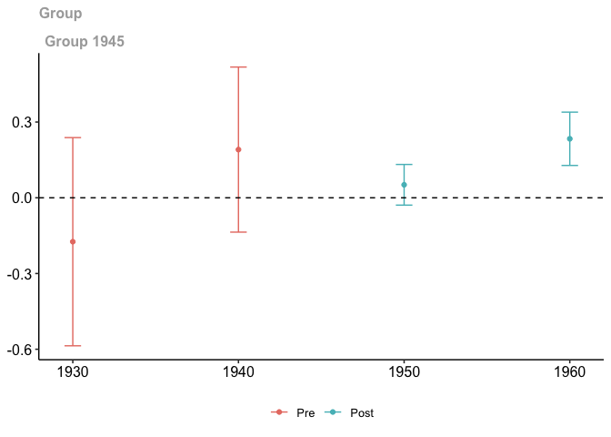

# Tennessee Valley Authority Empirical Application


## Intro

This exercise is going to work with data from Kline and Moretti (2014).
This paper aims to analyze the impacts of the “Tennessee Valley
Authority” (TVA) on local agriculture and manufacturing employment. The
TVA was a huge federal spending program in the 1940s that aimed at
electrification of the region, building hundreds of large dams (in
Scott’s terms, a ton of ‘bite’).

The region was centered in Tennessee and surrounding other southern
states. The region had a large agriculture industry, but very little
manufacturing. Electrification brought in a lot industry, moving the
economy away from agriculture. We are going to test for this in the data
using census data (recorded every 10 years).


``` r
library(tidyverse)
library(fixest)
library(DRDID)
library(did)

options(readr.show_progress = FALSE, readr.show_col_types = FALSE)
setFixest_etable(markdown = TRUE)
```

First, we will load our dataset:

``` r
df <- read_csv("data/tva.csv")
head(df)
```

    # A tibble: 6 × 18
      county_code  year   tva treat  post ln_agriculture ln_manufacturing
      <chr>       <dbl> <dbl> <dbl> <dbl>          <dbl>            <dbl>
    1 01001        1920     0     0     0           8.49             6.41
    2 01001        1930     0     0     0           8.64             6.36
    3 01001        1940     0     0     0           8.39             6.66
    4 01001        1950     0     0     1           7.78             7.14
    5 01001        1960     0     0     1           7.12             7.26
    6 01003        1920     0     0     0           8.35             7.10
    # ℹ 11 more variables: agriculture_share_1920 <dbl>,
    #   agriculture_share_1930 <dbl>, manufacturing_share_1920 <dbl>,
    #   manufacturing_share_1930 <dbl>, ln_avg_farm_value_1920 <dbl>,
    #   ln_avg_farm_value_1930 <dbl>, white_share_1920 <dbl>,
    #   white_share_1930 <dbl>, white_share_1920_sq <dbl>,
    #   white_share_1930_sq <dbl>, county_has_no_missing <lgl>

## Question 1

We will perform the basic 2x2 DID using just the years 1940 and 1960. We
will use as outcomes `ln_agriculture` and `ln_manufacturing`.

First, run the “classic” version using an indicator for treatment,
`tva`, and indicator for being the post-period, `post`, and the product
of the two. I recommend the package `fixest` for regression analysis.
I’ll be using it in the solutions.

``` r
est_40_60 <- feols(
  c(ln_agriculture, ln_manufacturing) ~ i(tva) + i(post) + i(tva * post),
  df |> filter(year == 1940 | year == 1960),
  cluster = ~county_code
)
```

``` r
etable(est_40_60)
```

<div class="etable">



</div>

Second, we will see in the 2x2 DID case, using county and time fixed
effects is equivalent:

``` r
est_40_60_full <- feols(
  c(ln_agriculture, ln_manufacturing) ~ i(tva * post) | county_code + year,
  df |> filter(year == 1940 | year == 1960),
  cluster = ~county_code
)
```

``` r
etable(est_40_60, est_40_60_full)
```

<div class="etable">



</div>

## Question 2

Moretti and Kline were nervous that the parallel trends assumption is a
bit of a strong assumption in the context. Why might that be in the
context of the Tennessee Valley Authority?

Answer: The TVA was built in the Tenneessee area precisely because the
area was not developing a strong manufacturing base. It is unlikely in
the absence of treatment that counties in the TVA area were going to
grow in manufacturing the same as outside counties

Let’s run a placebo analysis to test for this using 1920 as the
pre-treatment period and 1930 as the post-treatment period. What does
this tell us about the plausability of a parallel trends type
assumption?

``` r
df$is_1930 <- (df$year == 1930)
est_20_30 <- feols(
  c(ln_agriculture, ln_manufacturing) ~
    i(tva * is_1930) | county_code + year,
  df |> filter(year == 1920 | year == 1930),
  cluster = ~county_code
)
```

``` r
etable(est_20_30)
```

<div class="etable">



</div>

## Question 3

Let’s put this analysis together and run an event-study regression using
the full dataset

To do this, create a set of dummy variables that interact year with
treatment status. Estimate the TWFE model with these dummy variables.

``` r
df$rel_year <- ifelse(df$tva == TRUE, df$year, 1940)

est_event_study <- feols(
  c(ln_agriculture, ln_manufacturing) ~
    i(rel_year, ref = 1940) | county_code + year,
  df,
  cluster = ~county_code
)

iplot(est_event_study[[1]])
```



``` r
iplot(est_event_study[[2]])
```



## Question 4

Let’s use some controls to weaken the assumption to conditional parallel
trends. In particular, we are going to use a few covariates:
`agriculture_share_1920`, `agriculture_share_1930`,
`manufacturing_share_1920`, and `manufacturing_share_1930`.

What happens if we add those controls in linearly to our original
estimate?

``` r
feols(
  c(ln_agriculture, ln_manufacturing) ~
    i(rel_year, ref = 1940) +
      agriculture_share_1920 + agriculture_share_1930 +
      manufacturing_share_1920 + manufacturing_share_1930 |
      county_code + year,
  df,
  cluster = ~county_code
)
```

    Notes from the estimations:
    [x 2] The variables 'agriculture_share_1920', 'agriculture_share_1930',
    'manufacturing_share_1920' and 'manufacturing_share_1930' have been removed
    because of collinearity (see $collin.var).

    Standard-errors: Clustered (county_code) 
    Dep. var.: ln_agriculture
                    Estimate Std. Error    t value  Pr(>|t|)    
    rel_year::1920  0.014514   0.021480   0.675704 0.4992857    
    rel_year::1930 -0.012010   0.019438  -0.617875 0.5367095    
    rel_year::1950 -0.035038   0.011792  -2.971213 0.0029921 ** 
    rel_year::1960 -0.228198   0.021375 -10.675817 < 2.2e-16 ***
    ---
    Dep. var.: ln_manufacturing
                    Estimate Std. Error  t value   Pr(>|t|)    
    rel_year::1920 -0.461013   0.159203 -2.89576 3.8125e-03 ** 
    rel_year::1930 -0.335189   0.141392 -2.37064 1.7826e-02 *  
    rel_year::1950  0.071753   0.032135  2.23289 2.5637e-02 *  
    rel_year::1960  0.277419   0.046999  5.90259 4.0197e-09 ***

*Answer:* The covariates are dropped because they are collinear with the
county fixed effects.

The term $X_i \beta$ just causes a level shift in outcomes. This is not
what we want. We really want to allow for the *trends* in outcomes to
vary by covariate values. The simplest way to do this is to change our
model to interact covariates with indicators for each year
$X_i * 1(t = s) \beta$ for each year $s$. This is often written more
simply as $X_i \beta_t$ which lets $beta$ vary by year.

If you take first-differences, you end up with $$
 X_i \beta_t - X_i \beta_{t-1} = X_i (\beta_t - \beta_{t-1}),
$$ which says changes in outcome over time depend on your value of
$X_i$. \## Question 5

This question shows different weighs to incorporate covariates in a 2x2
difference-in-differences estimator. The goal is to relax our parallel
trends assumption to be conditional on X: $$
  E(Y_{i1}(0) - Y_{i1}(0) | D = 1, X = x) = E(Y_{i1}(0) - Y_{i1}(0) | D = 0, X = x).
$$

In words, this assumption says “take treated and control units with the
same value of $X$. These units on average have the same counterfactual
trend”. Full details to help with this question are given below in the
appendix notes. This question will walk you through three different
covariates-based estimators of ATTs: outcome regression, inverse
propensity of treatment weighting, and a doubly-robust combination of
the two.

Note: Some of the data contains missing values for the covariates.
Subset the data using `county_has_no_missing == TRUE` (for later).

``` r
# Drop counties with missing covariates
df <- filter(df, county_has_no_missing == TRUE)

# First-differenced data
first_diff <- df |>
  arrange(county_code, year) |>
  filter(year == 1940 | year == 1960) |>
  mutate(
    D_ln_manufacturing = ln_manufacturing - lag(ln_manufacturing, 1),
    D_ln_agriculture = ln_agriculture - lag(ln_agriculture, 1),
  ) |>
  filter(year == 1960)
```

### Part 1: Difference-in-Differences

Take first-differences of the outcome variable to form $\Delta Y$.
Create a new dataset that collapses the dataset using first-differences
for the outcome variables (each county should be a single row in the
dataset).

In part a, estimate the normal difference-in-differences estimate.
Additionally, run a second model that linearly controls for
`agriculture_share_1920`, `agriculture_share_1930`,
`manufacturing_share_1920`, and `manufacturing_share_1930`.

``` r
feols(
  D_ln_manufacturing ~ i(tva),
  data = first_diff
)
```

    OLS estimation, Dep. Var.: D_ln_manufacturing
    Observations: 2,730
    Standard-errors: IID 
                Estimate Std. Error  t value   Pr(>|t|)    
    (Intercept) 0.751353   0.012357 60.80329  < 2.2e-16 ***
    tva::1      0.276666   0.048530  5.70091 1.3195e-08 ***
    ---
    Signif. codes:  0 '***' 0.001 '**' 0.01 '*' 0.05 '.' 0.1 ' ' 1
    RMSE: 0.624142   Adj. R2: 0.011411

``` r
setFixest_fml(
  ..X = ~ agriculture_share_1920 + agriculture_share_1930 + manufacturing_share_1920 + manufacturing_share_1930
)
feols(
  D_ln_manufacturing ~ i(tva) + ..X,
  data = first_diff
)
```

    OLS estimation, Dep. Var.: D_ln_manufacturing
    Observations: 2,730
    Standard-errors: IID 
                              Estimate Std. Error  t value   Pr(>|t|)    
    (Intercept)               0.891840   0.045587 19.56334  < 2.2e-16 ***
    tva::1                    0.229163   0.046989  4.87700 1.1391e-06 ***
    agriculture_share_1920   -0.135234   0.095975 -1.40905 1.5893e-01    
    agriculture_share_1930    0.199174   0.094870  2.09944 3.5870e-02 *  
    manufacturing_share_1920 -0.542875   0.151357 -3.58671 3.4077e-04 ***
    manufacturing_share_1930 -1.145778   0.174470 -6.56718 6.1188e-11 ***
    ---
    Signif. codes:  0 '***' 0.001 '**' 0.01 '*' 0.05 '.' 0.1 ' ' 1
    RMSE: 0.591961   Adj. R2: 0.109419

### Part 2: Outcome Regression

Including covariates linearly is very simple and intuitively it allows
for $X_i$-specific trends. However, this assumes that treatment effects
can not vary by the value of $X$. For example, say $X$ is a dummy
variable for age. Then you are allowing for gender-specific trends, but
you are not allowing for treatment effects to vary by age. Note, this
problem is only with continuous covariates in X_i, we won’t estimate the
ATT (see Angrist 1998 or Słoczyński 2022).

Instead, we want to use outcome regression when doing covariate
adjustment in the outcome model. First, regress `D_ln_y` on the four
covariates *using just the untreated observations* (`tva == 0`). This
estimates $E(\Delta y | X, D = 0)$.

Second, predict out of sample this model for the full dataset. Let’s
call this `D_ln_y0_hat`. Last, take the difference between `D_ln_y` and
the predicted `D_ln_y0_hat` and average this for the treated group
(`tva == 1`). This is our outcome regression estimate.

``` r
# Estimate E[Y_{i1} - Y_{i0} | D = 0, X] as a linear function of X
dy_est_0 <- feols(
  D_ln_manufacturing ~ ..X,
  data = first_diff |> filter(tva == 0)
)

# Use our estimate of E[Y_{i1} - Y_{i0} | D = 0, X] to predict for each observation given their value of x
Dy0_hat <- predict(dy_est_0, newdata = first_diff)

# Outcome regression estimate
Dy <- first_diff$D_ln_manufacturing
D <- first_diff$tva
N <- nrow(first_diff)

w1 <- 1 / mean(D) * D
mean(w1 * Dy) - mean(w1 * Dy0_hat)
```

    [1] 0.2374156

With correct standard errors:

``` r
X <- with(
  df[df$year == 1940, ],
  cbind(agriculture_share_1920, agriculture_share_1930, manufacturing_share_1920, manufacturing_share_1930)
)
DRDID::reg_did_panel(
  y1 = df$ln_manufacturing[df$year == 1960],
  y0 = df$ln_manufacturing[df$year == 1940],
  D = df$tva[df$year == 1960],
  covariates = X
)
```

     Call:
    DRDID::reg_did_panel(y1 = df$ln_manufacturing[df$year == 1960], 
        y0 = df$ln_manufacturing[df$year == 1940], D = df$tva[df$year == 
            1960], covariates = X)
    ------------------------------------------------------------------
     Outcome-Regression DID estimator for the ATT:
     
       ATT     Std. Error  t value    Pr(>|t|)  [95% Conf. Interval] 
      0.2374     0.0434     5.4731       0        0.1524     0.3224  
    ------------------------------------------------------------------
     Estimator based on panel data.
     Outcome regression est. method: OLS.
     Analytical standard error.
    ------------------------------------------------------------------
     See Sant'Anna and Zhao (2020) for details.

### Part 3: Inverse Probability of Treatment Weighting

Now, lets use a propensity score method. Estimate a logistic regression
of $D$ on the covariates $X$ using the full sample. Predict fitted
propensity scores of this model.

Form the weights $w_1$ and $w_0$ as written in the appendix and form the
IPTW estimate.

``` r
# Fit propensity scores for treatment
ps <- predict(feglm(
  tva ~ ..X,
  data = first_diff, family = binomial()
))
# Avoid dividing by 0
ps <- pmin(ps, 1 - 1e-16)

# Generate propensity score weights for units
w1 <- 1 / mean(D) * D
w0 <- 1 / mean(D) * (1 - D) * ps / (1 - ps)

# This is our IPW estimate
mean(w1 * Dy) - mean(w0 * Dy)
```

    [1] 0.2371175

With correct standard errors:

``` r
DRDID::ipw_did_panel(
  y1 = df$ln_manufacturing[df$year == 1960],
  y0 = df$ln_manufacturing[df$year == 1940],
  D = df$tva[df$year == 1960],
  covariates = X
)
```

     Call:
    DRDID::ipw_did_panel(y1 = df$ln_manufacturing[df$year == 1960], 
        y0 = df$ln_manufacturing[df$year == 1940], D = df$tva[df$year == 
            1960], covariates = X)
    ------------------------------------------------------------------
     IPW DID estimator for the ATT:
     
       ATT     Std. Error  t value    Pr(>|t|)  [95% Conf. Interval] 
      0.2371     0.0436     5.4419       0        0.1517     0.3225  
    ------------------------------------------------------------------
     Estimator based on panel data.
     Horvitz-Thompson-type IPW estimator.
     Propensity score est. method: maximum likelihood.
     Analytical standard error.
    ------------------------------------------------------------------
     See Sant'Anna and Zhao (2020) for details.

> \[!WARNING\]  
> The weights are the ones proposed originally in Abadie (2005). They
> are based on Horvitz-Thompson weights (1952, JASA). These are
> sensitive when there is problems with the overlap conditions.
> Sant’Anna and Zhao (2020) (amongst others) suggest using Hajek
> weights, normalizing the Horvitz-Thompson weights by the sample mean
> of $w$. This is the default with `drdid::ipwdid`.
>
> For $w_0$, the Hajek weights are
> $\frac{1}{\mathbb{P}_n(D = 1)} \frac{(1-D) \hat{p}(X)}{1 - \hat{p}(X)} / \mathbb{E}_n(\frac{(1-D) \hat{p}(X)}{1 - \hat{p}(X)})$.
> The Hajek weights are unchanged for $w_1$ since
> $w_1 = \frac{D}{\mathbb{P}_n(D = 1)} / \mathbb{E}(\frac{D}{\mathbb{P}_n(D = 1)}) = w_1$.
>
> (h/t to Pedro Sant’Anna for bringing this up)

``` r
mean(w1 * Dy) - mean(w0 / mean(w0) * Dy)
```

    [1] 0.2337241

``` r
DRDID::std_ipw_did_panel(
  y1 = df$ln_manufacturing[df$year == 1960],
  y0 = df$ln_manufacturing[df$year == 1940],
  D = df$tva[df$year == 1960],
  covariates = X
)
```

     Call:
    DRDID::std_ipw_did_panel(y1 = df$ln_manufacturing[df$year == 
        1960], y0 = df$ln_manufacturing[df$year == 1940], D = df$tva[df$year == 
        1960], covariates = X)
    ------------------------------------------------------------------
     IPW DID estimator for the ATT:
     
       ATT     Std. Error  t value    Pr(>|t|)  [95% Conf. Interval] 
      0.2337     0.0433     5.4026       0        0.1489     0.3185  
    ------------------------------------------------------------------
     Estimator based on panel data.
     Hajek-type IPW estimator (weights sum up to 1).
     Propensity score est. method: maximum likelihood.
     Analytical standard error.
    ------------------------------------------------------------------
     See Sant'Anna and Zhao (2020) for details.

### Part 4: Doubly-Robust DID Estimator

From the previous questions, you have all the parts to estimate the
doubly-robust DID estimator. Do this.

``` r
mean(w1 * (Dy - Dy0_hat)) - mean(w0 / mean(w0) * (Dy - Dy0_hat))
```

    [1] 0.2336144

With correct standard errors:

``` r
DRDID::drdid_panel(
  y1 = df$ln_manufacturing[df$year == 1960],
  y0 = df$ln_manufacturing[df$year == 1940],
  D = df$tva[df$year == 1960],
  covariates = X
)
```

     Call:
    DRDID::drdid_panel(y1 = df$ln_manufacturing[df$year == 1960], 
        y0 = df$ln_manufacturing[df$year == 1940], D = df$tva[df$year == 
            1960], covariates = X)
    ------------------------------------------------------------------
     Locally efficient DR DID estimator for the ATT:
     
       ATT     Std. Error  t value    Pr(>|t|)  [95% Conf. Interval] 
      0.2336     0.0433     5.3948       0        0.1487     0.3185  
    ------------------------------------------------------------------
     Estimator based on panel data.
     Outcome regression est. method: OLS.
     Propensity score est. method: maximum likelihood.
     Analytical standard error.
    ------------------------------------------------------------------
     See Sant'Anna and Zhao (2020) for details.

``` r
df$county_code_numeric <- to_integer(df$county_code)
X_fml <- ~ agriculture_share_1920 + agriculture_share_1930 + manufacturing_share_1920 + manufacturing_share_1930
DRDID::drdid(
  yname = "ln_manufacturing",
  tname = "year",
  idname = "county_code_numeric",
  dname = "tva",
  xformla = X_fml,
  data = df |> filter(year == 1940 | year == 1960),
  estMethod = "trad"
)
```

     Call:
    DRDID::drdid(yname = "ln_manufacturing", tname = "year", idname = "county_code_numeric", 
        dname = "tva", xformla = X_fml, data = filter(df, year == 
            1940 | year == 1960), estMethod = "trad")
    ------------------------------------------------------------------
     Locally efficient DR DID estimator for the ATT:
     
       ATT     Std. Error  t value    Pr(>|t|)  [95% Conf. Interval] 
      0.2336     0.0433     5.3948       0        0.1487     0.3185  
    ------------------------------------------------------------------
     Estimator based on panel data.
     Outcome regression est. method: OLS.
     Propensity score est. method: maximum likelihood.
     Analytical standard error.
    ------------------------------------------------------------------
     See Sant'Anna and Zhao (2020) for details.

## Question 6

Now, let’s try using the `DRDID` package to do this more simply.

Note: DRDID requires the `idname` to be a numeric, so you need to create
a new variable for this.

``` r
# DRDID requires a numeric id
df$county_code_numeric <- to_integer(df$county_code)
X_fml <- ~ agriculture_share_1920 + agriculture_share_1930 + manufacturing_share_1920 + manufacturing_share_1930

DRDID::drdid(
  yname = "ln_manufacturing",
  tname = "year",
  idname = "county_code_numeric",
  dname = "tva",
  xformla = X_fml,
  data = df |> filter(year == 1940 | year == 1960),
  estMethod = "trad"
)
```

     Call:
    DRDID::drdid(yname = "ln_manufacturing", tname = "year", idname = "county_code_numeric", 
        dname = "tva", xformla = X_fml, data = filter(df, year == 
            1940 | year == 1960), estMethod = "trad")
    ------------------------------------------------------------------
     Locally efficient DR DID estimator for the ATT:
     
       ATT     Std. Error  t value    Pr(>|t|)  [95% Conf. Interval] 
      0.2336     0.0433     5.3948       0        0.1487     0.3185  
    ------------------------------------------------------------------
     Estimator based on panel data.
     Outcome regression est. method: OLS.
     Propensity score est. method: maximum likelihood.
     Analytical standard error.
    ------------------------------------------------------------------
     See Sant'Anna and Zhao (2020) for details.

Note: I passed `estMethod = "trad"` to use the standard weights from
Abadie (2005). Sant’Anna and Zhao propose an improved estimator that can
be called `estMethod = "imp"`. This improvement is especially important
when overlap is not perfect.

``` r
DRDID::drdid(
  yname = "ln_manufacturing",
  tname = "year",
  idname = "county_code_numeric",
  dname = "tva",
  xformla = X_fml,
  data = df |> filter(year == 1940 | year == 1960),
  estMethod = "imp"
)
```

     Call:
    DRDID::drdid(yname = "ln_manufacturing", tname = "year", idname = "county_code_numeric", 
        dname = "tva", xformla = X_fml, data = filter(df, year == 
            1940 | year == 1960), estMethod = "imp")
    ------------------------------------------------------------------
     Further improved locally efficient DR DID estimator for the ATT:
     
       ATT     Std. Error  t value    Pr(>|t|)  [95% Conf. Interval] 
      0.2334     0.0433     5.3894       0        0.1485     0.3183  
    ------------------------------------------------------------------
     Estimator based on panel data.
     Outcome regression est. method: weighted least squares.
     Propensity score est. method: inverse prob. tilting.
     Analytical standard error.
    ------------------------------------------------------------------
     See Sant'Anna and Zhao (2020) for details.

## Question 7

We are going to now use `did` to estimate an event study. As a default,
`did` calls `DRDID` under the hood. Let’s see this using `did::att_gt`.
We need to create a variable for “treatment timing groups”, i.e. what
year a county starts treatment. The package takes the convention that
group = 0 for never-treated group.

``` r
# = 0 for never-treated, = 1950 for TVA counties
df$g <- df$tva * 1945
(attgt_man <- did::att_gt(
  yname = "ln_manufacturing",
  tname = "year",
  idname = "county_code_numeric",
  gname = "g",
  xformla = X_fml,
  data = df
))
```


    Call:
    did::att_gt(yname = "ln_manufacturing", tname = "year", idname = "county_code_numeric", 
        gname = "g", xformla = X_fml, data = df)

    Reference: Callaway, Brantly and Pedro H.C. Sant'Anna.  "Difference-in-Differences with Multiple Time Periods." Journal of Econometrics, Vol. 225, No. 2, pp. 200-230, 2021. <https://doi.org/10.1016/j.jeconom.2020.12.001>, <https://arxiv.org/abs/1803.09015> 

    Group-Time Average Treatment Effects:
     Group Time ATT(g,t) Std. Error [95% Simult.  Conf. Band]  
      1945 1930  -0.1740     0.1696       -0.5863      0.2383  
      1945 1940   0.1909     0.1345       -0.1361      0.5178  
      1945 1950   0.0514     0.0331       -0.0291      0.1320  
      1945 1960   0.2336     0.0434        0.1280      0.3392 *
    ---
    Signif. codes: `*' confidence band does not cover 0

    P-value for pre-test of parallel trends assumption:  0.32835
    Control Group:  Never Treated,  Anticipation Periods:  0
    Estimation Method:  Doubly Robust

``` r
did::ggdid(attgt_man)
```


