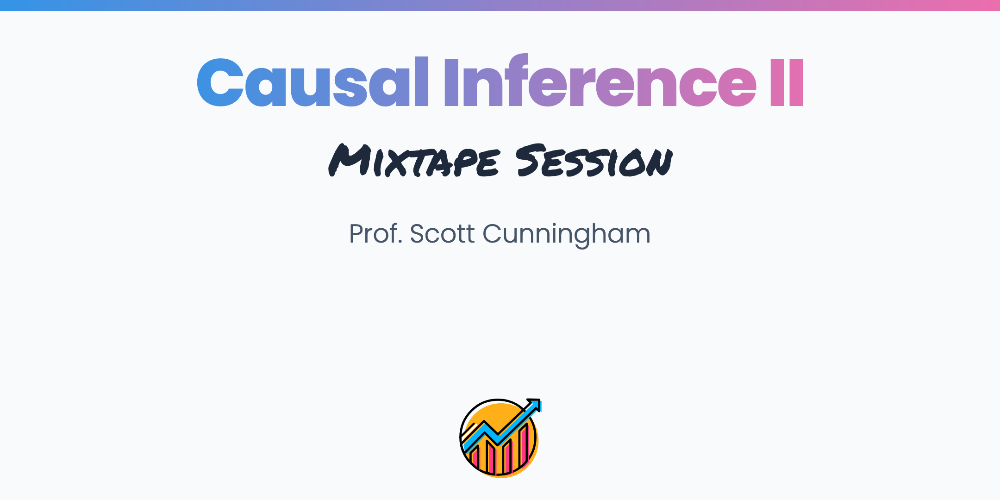

 
 

 

Causal inference Part II is a 4-day workshop in design based causal inference series. It will cover three contemporary research designs in causal inference -- difference-in-differences, synthetic control and matching/weighting methods -- as well as introduce participants to causal graphs developed by Judea Pearl and others. Each day is 8 hours with 15 minute breaks on the hour plus an hour for lunch. We will review the theory behind each design, go into detail on the intuition of the estimation strategies and identification itself, as well as explore code in R and Stata and applications using these methods. The goal as always is that participants leave the workshop with competency and confidence. This class will be a sequel to the 4-day workshop on Causal Inference Part I.
 

 
 

<b>Basic Difference-in-Differences</b>
 

<b>Slides</b>
           

<b>Code</b>
           

<b>Readings</b>

 

<b>Difference-in-Differences with Covariates</b>
 

<b>Slides</b>
           

<b>Code</b>
           

<b>Readings</b>

 

<b>Differential Timing and Bacon-Decomposition</b>
 

<b>Slides</b>
           

<b>Code</b>

[Shiny App for Bacon Decomposition](https://mixtape.shinyapps.io/Bacon-Decomposition/)
           

<b>Readings</b>

 

<b>Callaway and Sant'Anna</b>
 

<b>Slides</b>
           

<b>Code</b>
           

<b>Readings</b>

 

<b>Sun and Abraham</b>
 

<b>Slides</b>
           

<b>Code</b>
           
[Shiny App for Event Study](https://mixtape.shinyapps.io/Event-Study/)

<b>Readings</b>

 

<b>Imputation Estimators</b>
 

<b>Slides</b>
           

<b>Code</b>
           

<b>Readings</b>

 

<b>Time-varying Covariates</b>
 

<b>Slides</b>
           

<b>Code</b>
           

<b>Readings</b>

 

<b>Continuous Treatment</b>
 

<b>Slides</b>
           

<b>Code</b>
           

<b>Readings</b>

 

